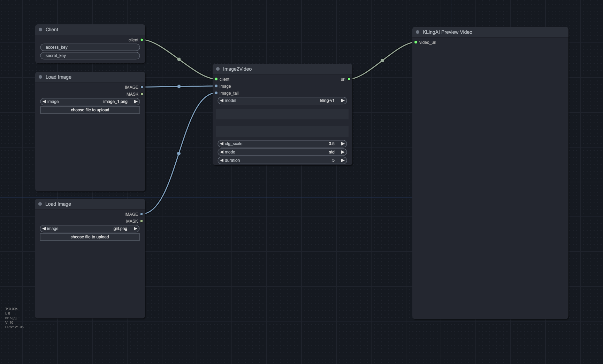

# ComfyUI-KLingAI-API

This is a custom node for ComfyUI that allows you to use the KLing AI API directly in ComfyUI. KLing AI API is based on top of [KLing AI](https://klingai.com/). For more information, see [KLing AI API Documentation](https://docs.qingque.cn/d/home/eZQAmVjsdCh45-NZ2-_XyYRmG?identityId=2Cn18n4EIHT).

## Requirements
Before using this node, you need to have [a KLing AI API key](https://docs.qingque.cn/d/home/eZQA6m4cRjTB1BBiE5eJ4lyvL?identityId=2Cn18n4EIHT). 

## Installation

### Installing manually

1. Navigate to the `ComfyUI/custom_nodes` directory.

2. Clone this repository: `git clone https://github.com/KwaiVGI/ComfyUI-KLingAI-API`
  
3. Install the dependencies:
  - Windows (ComfyUI portable): `python -m pip install -r ComfyUI-KLingAI-API\requirements.txt`
  - Linux or MacOS: `cd ComfyUI-KLingAI-API && pip install -r requirements.txt`

4. If you don't want to expose your key, you can add it into the `config.ini` file and keep it empty in the node.

5. Start ComfyUI and enjoy using the KLing AI API node!

## Nodes

### Client

This node is used to create a KLing AI client.

### Image Generator

This node is used to generate an image given a text prompt.

  

### Text2Video

This node is used to generate a video given a text prompt.

  

### Image2Video

This node is used to generate a video given an image.

  

### Kolors Virtual Try-On

This node is used to display the try-on effect.

  

## Pricing

For pricing, follow [KLing AI Pricing](https://klingai.com/dev-center).
